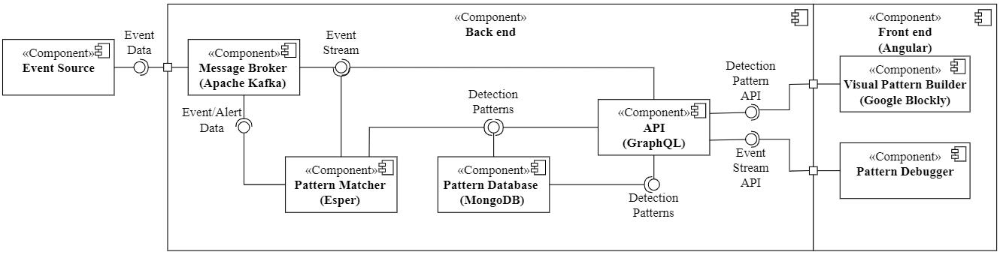

# Pattern Matcher

## Setup

The overall infrastructure follows a Event-Driven Architecture with Apache Kafka as the Message Broker. The architecture is divided into front end and back end. The back end is responsible for recognizing indicators and incidents based on predefined patterns and the front end provides a user interface allowing to create, edit, and debug these patterns. Please refer to the corresponding [repository](https://github.com/Knowledge-based-Security-Analytics/Front-end/) for the implementation of the front end.


### Install with Docker Compose
The easiest way to setup the back end infrastructure is to use Docker Compose following the following steps:

1. Install Docker Compose as explained here: https://docs.docker.com/compose/install/
2. Download and unzip or clone the project:
    ```bash
    git clone https://github.com/Knowledge-based-Security-Analytics/Pattern-Matcher.git
    ```
3. Within the docker-compose.yml file adjust `KAFKA_ADVERTISED_HOST_NAME=192.168.2.116` to represent the IP of the machine where it is running on.
4. cd into the cloned repository.
5. Run Docker Compose to start Apache Kafka and MongoDB:
    ```bash
    docker-compose up
    ```
6. Run SpringBootEsperApplication.java in your Java VM.
7. Start the GraphQL API as explained in the respective [repository](https://github.com/Knowledge-based-Security-Analytics/API).
8. Finally you can start the [front end application](https://github.com/Knowledge-based-Security-Analytics/Front-end/) and create and debug your statements.


